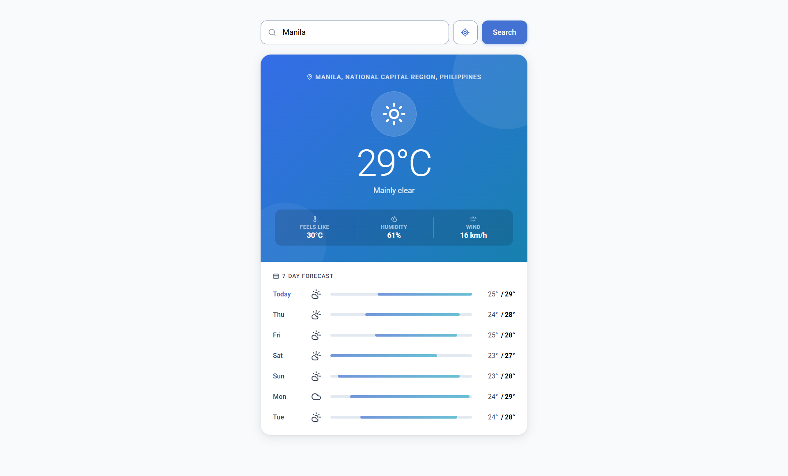

# Weather App

> Instant weather for any city — no API key, no build step, no npm. Open `index.html` and go.

[](https://johnlester-0369.github.io/web-weather-app)
[](https://opensource.org/licenses/MIT)



---

## What it does

Weather App resolves any city name to live conditions and a 7-day forecast using the free [Open-Meteo](https://open-meteo.com/) API — no account, no rate limits, no key required.

**Why it exists:** Most weather tutorials reach for a paid API key, a bundler, and three npm packages before rendering a single temperature. This project is the counter-argument: a polished, production-quality result from plain HTML, CSS, and ES modules.

---

## Features

| Capability | Detail |
|---|---|
| City search | Debounced geocoding suggestions as you type (Open-Meteo Geocoding API) |
| Current conditions | Temperature, feels-like, humidity, wind speed, WMO weather icon |
| 7-day forecast | Min/max temps with relative range bars scaled to the week's full spread |
| Geolocation | Opt-in "Use my location" — no browser prompt fires on page load |
| UI states | Distinct loading, error, and empty states; no silent failures |
| Responsive | Tested at 320 px, 375 px, 480 px, and 768 px |
| Zero dependencies | Vanilla ES modules + [Lucide](https://lucide.dev/) icons via CDN |

---

## Quick Start

No build step or package manager required.

```bash
git clone https://github.com/johnlester-0369/web-weather-app.git
cd web-weather-app
```

Open `index.html` directly in a browser, **or** use any static server to avoid ES module CORS restrictions on `file://`:

```bash
# Python (built-in, no install)
python3 -m http.server 8080

# Node (one-off via npx, no global install)
npx serve .

# VS Code: Install "Live Server" → right-click index.html → Open with Live Server
```

Visit `http://localhost:8080`, type a city name, or click **Use my location**.

---

## Architecture

`app.js` is the only orchestrator. Every other module exports pure functions with no side effects outside its declared responsibility — each is independently readable and testable in isolation.

```
index.html          HTML shell + all CSS design tokens; loads Lucide UMD and js/app.js
│
└── js/
    ├── app.js              Entry point — event wiring, load/search/geolocation orchestration
    │
    ├── api/
    │   ├── geocoding.js    geocodeCity(query) → Open-Meteo Geocoding API
    │   └── weather.js      fetchWeather(lat, lon) → Open-Meteo Forecast API
    │
    ├── ui/
    │   ├── render.js       renderCurrent() / renderForecast() — DOM writes + lucide.createIcons()
    │   └── state.js        showLoading() / showCard() / showError() / closeSuggestions()
    │
    ├── constants/
    │   └── wmo.js          WMO weather code map + getWeatherMeta(code, isDay)
    │
    └── utils/
        └── format.js       formatDay(isoDate) / round(n)
```

**Data flow:**

1. User types → `app.js` debounces input → `geocodeCity()` → suggestion dropdown renders
2. User selects a city → `app.js` calls `fetchWeather(lat, lon)` → passes response to `renderCurrent()` + `renderForecast()`
3. `state.js` transitions the UI: `empty → loading → card` on success, `loading → error` on failure

**Why the code is structured this way:**

- **Lucide loaded as UMD in `<head>`, not as an ES module** — ES modules are deferred by spec, so the UMD bundle always executes first. Every call to `lucide.createIcons()` inside the deferred module graph is therefore safe without any async load guard.
- **WMO codes centralised in `constants/wmo.js`** — both `render.js` and the daily forecast loop resolve icons and labels from one authoritative map. Adding a new weather condition means editing one file, not hunting across the codebase.
- **Geolocation is always opt-in** — `getCurrentPosition()` fires only on explicit button click. Calling it on page load would trigger the browser's permission prompt before the user has any context for why the app wants their location.
- **`state.js` owns all `classList` mutations** — feature modules call `showLoading()` or `showError()` rather than touching `.classList` directly. Adding a new UI state (e.g. an offline banner) means editing one file and calling one function everywhere else.

---

## API

This app uses the [Open-Meteo](https://open-meteo.com/) free weather API — no account or API key needed.

| Endpoint | Used for |
|---|---|
| `geocoding-api.open-meteo.com/v1/search` | City name → lat/lon coordinates (up to 5 suggestions) |
| `api.open-meteo.com/v1/forecast` | Current conditions + 7-day daily forecast |

Icons: [Lucide](https://lucide.dev/) (ISC licence) via CDN · Font: Roboto via Google Fonts

---

## Contributing

1. Fork the repo and create a branch: `git checkout -b your-feature`
2. No build step — edit files directly and open `index.html` in a browser to test
3. Check the UI at 320 px, 375 px, and 768 px before submitting
4. Open a pull request describing **what** changed and **why**

Bug reports and feature ideas are welcome via [GitHub Issues](https://github.com/johnlester-0369/web-weather-app/issues).

---

## Licence

[MIT](https://opensource.org/licenses/MIT)